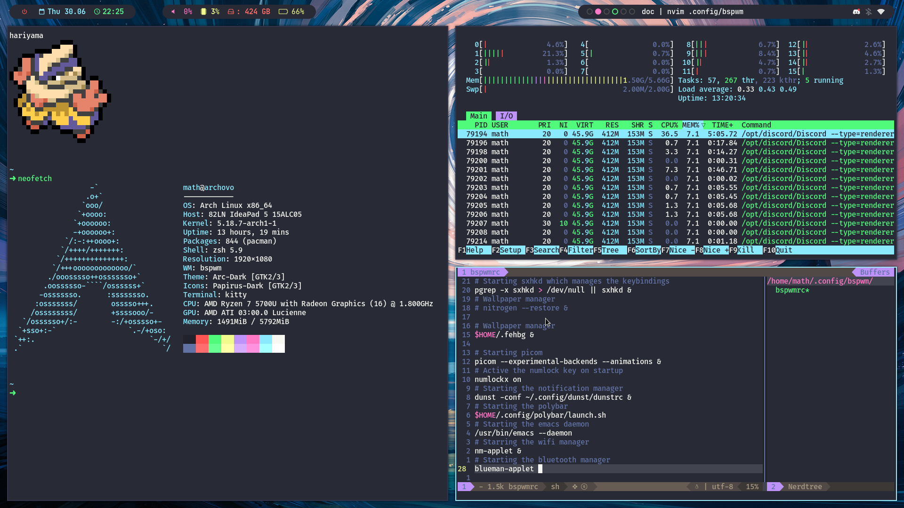

# My personal config

## Features

- Arch
- Dunst
- Zsh
- Kitty
- bspwm
- Polybar
- feh
- Thunar
- Doom emacs and SpaceVim
- picom
- rofi

## Dependencies

All quoted packages above to start with. Moreover, be sure to have a functional sound system (I use `amixer` in my keybindings). 

Also, I use arcolinux's scripts which give me a better lockscreen and a beautiful logout menu. Be sure you have installed those scripts too. 

>TODO: a complete list of all details of the config
